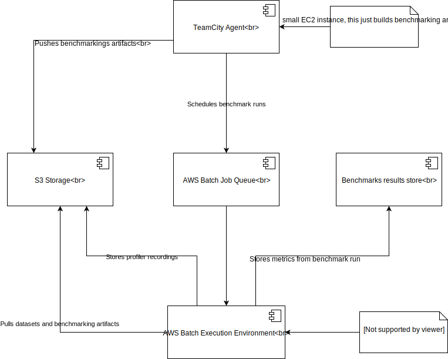

# Architecture overview

[Draw.io diagram source](https://www.draw.io/?page-id=d8cSnnHiEe-P8-4SL6Jb&scale=auto#G1Z5smRPEfWNSEWeidfOiFIAJdWb6HpEZg)

## Build pipeline

* TeamCity runs a build on a small instance, once artifacts are built, it pushes them to S3 (macro.jar, for example)
* Then it runs a process which schedules benchmarking runs to an AWS batch queue and afterwards, it just sits and watches the progress of scheduled benchmark runs
* Execution environment picks up a job from the queue, finds the right EC2 instance to run this job (based on job spec)
* On the EC2 instance, we need a small “bootstrap” to be run, with following steps
    * Pull macro.jar (or any other artifact), this should pull artifact which was built in the first step (we need to version these things)
    * Pulls the right data set (based on  job spec)
    * And from now on the process runs “as it used to be”,
    * Once the benchmark is done we push results to store and recordings and logs to S3

## Components

* maven modules
    * `benchmark-infra-common`, contains shared code, mainly components interacting with AWS
    * `benchmark-infra-scheduler`, component responsible for uploading artifacts to S3 and scheduling benchmarking run
    * `benchmark-infra-worker`, component responsible for downloading artifacts, running benchmark and uploading results
* infrastucture,
    * `src/main/ami/benchmark-run-batch-worker/template.json`, Packer template which creates new AMI instance
    * `src/main/stack/aws-batch-formation.json`, CloudFormation stack which creates necessary components in AWS
    * `src/main/infra-build/Dockerfile`, docker image used to run infra builds
    * `src/main/worker/Dockerfiler`, docker images in which workers are run

# Development guidelines

## Building worker Docker image

This is a docker image which contains profilers, plus small worker bootstrap
script. This is used in AWS batch job definition in CloudFormation stack down
below.

You can build by simply calling `src/main/build-worker-docker.sh`. This script has two optional arguments:
* `--push` which triggers push to ECR repository after successful build
* `--tag-suffix [suffix]` which appends suffix to docker image tag, it is helpful during testing,

## Building AWS Batch AMI

Default AMI used by AWS Batch has limitations on available storage space (10G).
Which is not enough for benchmarking workloads. In order to overcome this limitation we
have to build our own AMI.

There is a requirement that this AMI should be built from
[ECS optimized AMI](https://docs.aws.amazon.com/AmazonECS/latest/developerguide/ecs-optimized_AMI.html)

We are going to use [Packer](https://www.packer.io/) from HashCorp to simplify this process.

In order to build a new AMI image, you should invoke the following command:

	packer build src/main/ami/benchmark-run-batch-worker/template.json

This will build new AMI and push it to EC2. Then you will have to use new AMI id
in AWS Batch computing environment configuration.

## Deploy AWS Batch stack

AWS Batch is deployed using CloudFormation. Here is easy one liner to deploy/update stack.

	aws --region eu-north-1 cloudformation deploy --stack-name benchmarking --template-file src/main/stack/aws-batch-formation.json

## Your own private infrastructure

If you want to play, test or experiment with infrastructure and don't touch (unstabilize) production environment,
you can use `src/main/deploy-infra.sh` to deploy your private infrastructure. This script requires two arguments:
* `--env`, which is name of your environment,
* `--results-db-password`, because we don't want to hard code it,

Once you are done with your experiments, please be so kind and clean up infrastructure with simple call to AWS Batch"

    aws --region eu-north-1 cloudformation delete-stack --stack-name [env]

## Get logs of batch job

Scheduler will output log stream name when job is scheduled, later on you can use it
in AWS console (go to CloudWatch->Logs) or through AWS CLI, with little bit of
magic from `jq`:

       aws logs get-log-events --log-group-name "/aws/batch/job" --log-stream-name [log-stream-name] --query "events[].message"  | jq -r 'join("\n")'

## Working locally with worker

The best way to develop and debug worker is to do it through docker container

	docker run -v $HOME/.aws:/root/.aws 535893049302.dkr.ecr.eu-north-1.amazonaws.com/benchmarks-worker:latest /work/bootstrap-worker.sh \

    # *** Schedule/Run Worker ***
    --worker-artifact-uri  \
    s3://benchmarking.neo4j.com/artifacts/benchmark-infra-worker.jar \

    run-worker,

    # *** Run Workload ***    
    --workload \
    accesscontrol \
    --db-edition \
    ENTERPRISE \
    --jvm \
    /usr/lib/jvm/java-8-oracle/bin/java \
    --profilers \
    GC \
    --warmup-count \
    1000 \
    --measurement-count \
    1000 \
    --forks \
    1 \
    --time-unit \
    MICROSECONDS \
    --runtime \
    DEFAULT \
    --planner \
    DEFAULT \
    --execution-mode \
    EXECUTE \
    --error-policy \
    REPORT_THEN_FAIL \
    --jvm-args \
    -Xmx4g \
    --neo4j-deployment \
    embedded \

    # *** Project Version ***
    --neo4j-commit \
    f3fb07ec92527f740e527e4d128c5c1faf12b8a9 \
    --neo4j-version \
    3.4.14 \
    --neo4j-branch \
    3.4 \
    --neo4j-branch-owner \
    neo4j \
    --tool-commit \
    f3fb07ec92527f740e527e4d128c5c1faf12b8a9 \
    --tool-branch-owner \
    neo4j \
    --tool-branch \
    3.4 \
    --teamcity-build \
    5531608 \
    --parent-teamcity-build \
    5519409 \
    --triggered-by \
    new_infra \

    # *** AWS ***
    --workspace-dir \
    /work/run \
    --aws-secret \
    [aws secret] \
    --aws-key \
    [aws key] \
    --aws-region \
    [aws region] \
    --db-name \
    accesscontrol \

    # *** Benchmark Results Store ***
    --results-store-user \
    client \
    --results-store-pass \
    [result store password] \
    --results-store-uri \
    bolt+routing://e605d648.databases.neo4j.io:7687

# Costs

Are you curious how much our usage of AWS Batch is costing?

All the instances are tagged with `owner:benchmarking`. So you can easily find this info in the AWS user inteface.
Go to the cost explorer and filter by tag, `benchmarking`.
[Or click on this](https://console.aws.amazon.com/cost-reports/home?region=eu-north-1#/custom?groupBy=None&hasBlended=false&hasAmortized=false&excludeDiscounts=true&excludeTaggedResources=false&timeRangeOption=Last7Days&granularity=Daily&reportName=&reportType=CostUsage&isTemplate=true&filter=%5B%7B%22dimension%22:%22TagKeyValue%22,%22values%22:null,%22include%22:true,%22children%22:%5B%7B%22dimension%22:%22owner%22,%22values%22:%5B%22benchmarking%22%5D,%22include%22:true,%22children%22:null%7D%5D%7D%5D&chartStyle=Group&forecastTimeRangeOption=None&usageAs=usageQuantity)
